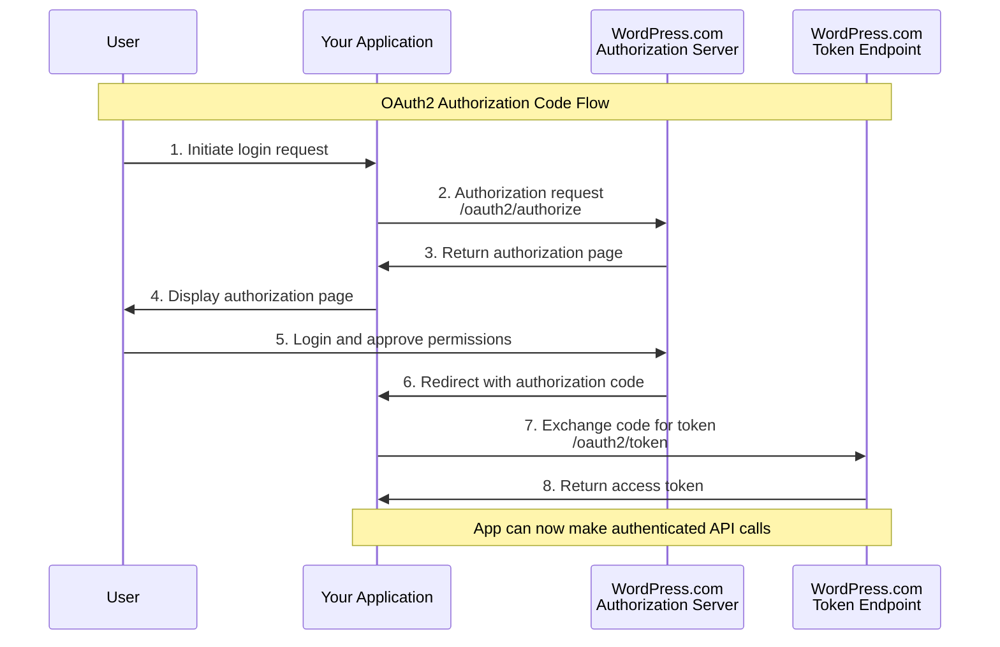
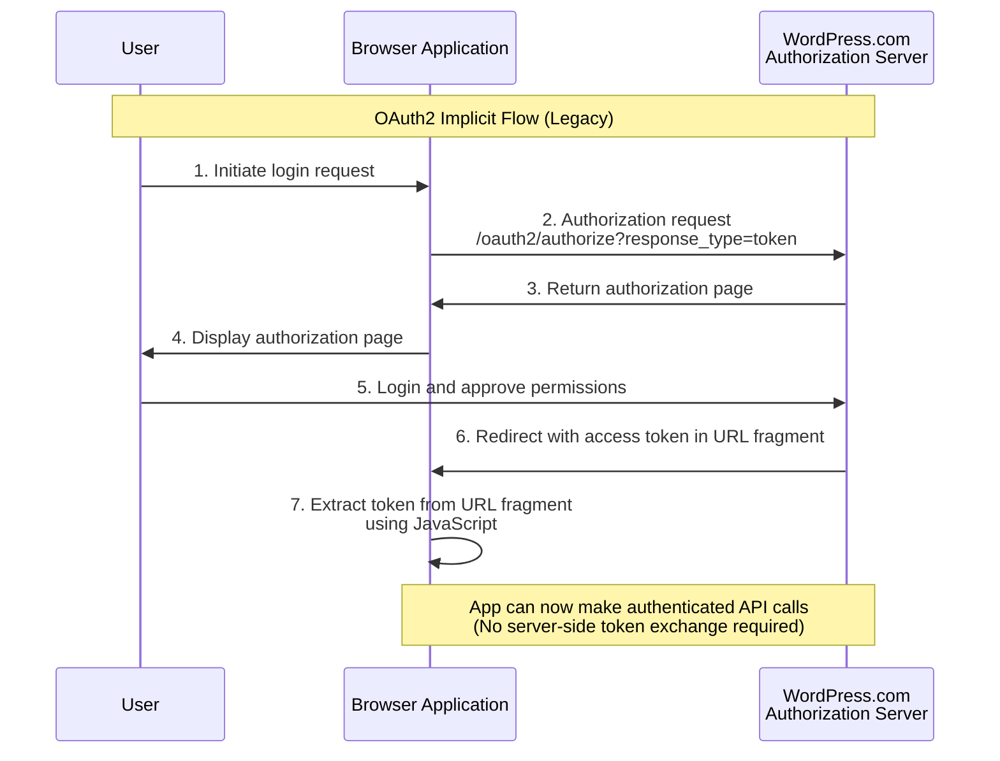
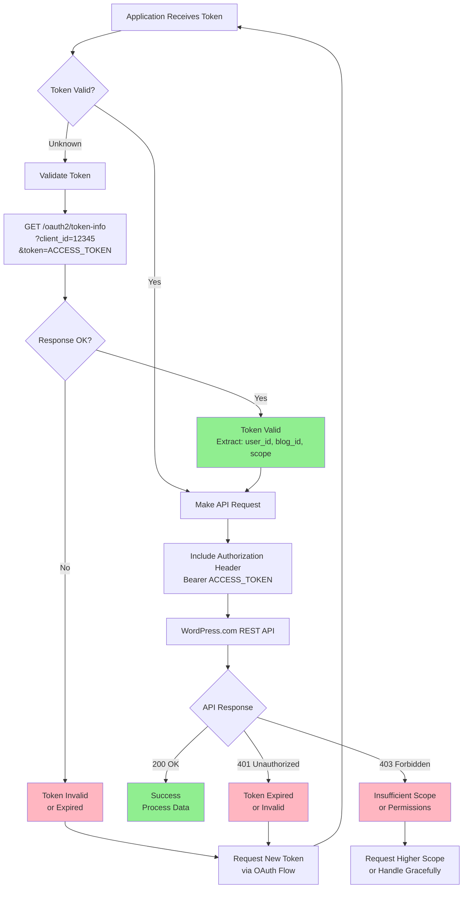

# OAuth2 Authentication

[OAuth2](https://oauth.net/2/) is a secure authentication protocol that enables applications to interact with WordPress.com sites and self-hosted WordPress sites running Jetpack without requiring users to share their sensitive credentials directly with third-party applications. This approach provides granular permission control and enhanced security for both users and developers.

## Understanding OAuth2 for WordPress.com

OAuth2 represents a sophisticated authentication framework designed specifically for **third-party applications** that need controlled access to user data. [Unlike Application Passwords](https://wordpress.com/support/security/two-step-authentication/application-specific-passwords/) which grant comprehensive administrative access, OAuth2 implements a **granular permission system through scopes** that allows applications to request only the specific access levels they need.

When users authorize your application through OAuth2, they authenticate using their existing WordPress.com credentials and can see exactly what permissions your application is requesting. They can then choose to grant or deny specific access levels, providing transparency and control over their data.

## Prerequisites

Before developing your OAuth2 application, you need to have a WordPress.com application registered with the following data:

1. **Client ID**: Identifies your application
2. **Client Secret**: Authenticates your application (keep secure)
3. **Redirect URI**: Where users return after authorization

You can obtain these credentials through the [WordPress.com Applications Manager](https://developer.wordpress.com/apps/).

> Use [this form](https://developer.wordpress.com/apps/new/) to register a new WordPress.com Application


## OAuth2 endpoints

If you're new to OAuth2, you can learn more at [https://oauth.net/](https://oauth.net/). For WordPress.com integration, you need to understand the core OAuth2 endpoints available under the `https://public-api.wordpress.com/oauth2/` namespace. These endpoints work consistently for both WordPress.com sites and Jetpack-connected sites.

### Authorization Endpoint

**Endpoint**: `https://public-api.wordpress.com/oauth2/authorize`
**Method**: GET (via user redirect)

This is where the OAuth2 flow begins. Users are presented with an authorization interface to review and approve the permissions your application is requesting. The endpoint validates your application credentials, redirect URI, and generates secure authorization codes for token exchange.

**Required Parameters**:
- `client_id`: Your application's client ID
- `redirect_uri`: Must match registered redirect URI
- `response_type`: `"code"` for Authorization Code Flow or `"token"` for Implicit Flow

**Optional Parameters**:
- `scope`: Space-separated permissions (defaults to single-blog access)
- `state`: Recommended for CSRF protection
- `blog`: Specific blog URL or ID for single-site access

**Example Authorization URL** (Authorization Code Flow):
```
https://public-api.wordpress.com/oauth2/authorize?client_id=12345&redirect_uri=https%3A%2F%2Fyourapp.com%2Fcallback&response_type=code&scope=posts%20media&state=abc123xyz
```

**Example Authorization URL** (Implicit Flow):
```
https://public-api.wordpress.com/oauth2/authorize?client_id=12345&redirect_uri=https%3A%2F%2Fyourapp.com%2Fcallback&response_type=token&scope=posts%20media&state=abc123xyz
```

**Example Authorization URL** (Specific Blog):
```
https://public-api.wordpress.com/oauth2/authorize?client_id=12345&redirect_uri=https%3A%2F%2Fyourapp.com%2Fcallback&response_type=code&blog=yourblog.wordpress.com&scope=posts%20media&state=abc123xyz
```

**Response/Action**:
After user approval, redirects to your `redirect_uri` with:
- **Authorization Code Flow**: `?code=AUTHORIZATION_CODE&state=YOUR_STATE`
- **Implicit Flow**: `#access_token=TOKEN&expires_in=64800&token_type=bearer&site_id=BLOG_ID`
- **User denial**: `?error=access_denied`

> **Important Note**: The `redirect_uri` parameter must exactly match the redirect URI registered when creating your application. Even minor differences (like missing trailing slashes) will cause the authorization to fail. This is a security measure to prevent malicious redirects.


### Token Request Endpoint

**Endpoint**: `https://public-api.wordpress.com/oauth2/token`
**Method**: POST

This secure server-to-server endpoint handles two different grant types for obtaining access tokens. Choose the appropriate grant type based on your use case:

#### Authorization Code Grant (Production Use)

Use this grant type for all production applications. It exchanges authorization codes (received from user authorization) for access tokens while keeping your client secret secure.

**Required Parameters**:
- `client_id`: Your application's client ID
- `client_secret`: Your application's client secret
- `code`: Authorization code from the authorization step
- `grant_type`: Must be `"authorization_code"`
- `redirect_uri`: Must match the authorization redirect URI

**Example Request**:
```bash
curl -X POST https://public-api.wordpress.com/oauth2/token \
  -d "client_id=12345" \
  -d "client_secret=your_client_secret" \
  -d "code=received_authorization_code" \
  -d "grant_type=authorization_code" \
  -d "redirect_uri=https://yourapp.com/callback"
```

#### Password Grant (Development & Testing Only)

⚠️ **Development Use Only** - This grant type allows application owners to obtain tokens directly using their WordPress.com credentials, bypassing the user authorization flow.

**Use Password Grant For**:
- Testing API endpoints during development
- Automated testing where user authorization simulation is impractical
- Personal development on your own WordPress.com sites

**Security Restrictions**:
- Only works with **your own** WordPress.com credentials (not other users')
- Requires exposing credentials in your code
- Bypasses OAuth2's user consent and security benefits
- **Never use in production applications**

**Required Parameters**:
- `client_id`: Your application's client ID  
- `client_secret`: Your application's client secret
- `grant_type`: Must be `"password"`
- `username`: Your WordPress.com username
- `password`: Your WordPress.com password (or Application Password if 2FA enabled)

**Example Request**:
```bash
curl -X POST https://public-api.wordpress.com/oauth2/token \
  -d "client_id=12345" \
  -d "client_secret=your_client_secret" \
  -d "grant_type=password" \
  -d "username=your_username" \
  -d "password=your_password_or_app_password"
```

**Two-Factor Authentication**: If you have 2FA enabled, create an Application Password in your [WordPress.com Account Settings](https://wordpress.com/me/security) and use that instead of your regular password.

**Migration Path**: Start with Password Grant for development convenience, but implement Authorization Code Flow before launching to production. Think of Password Grant as a development shortcut that must be replaced with proper user authorization in live applications.

**Token Response Format** (Both Grant Types):
```json
{
    "access_token": "YOUR_API_TOKEN",
    "blog_id": "blog_id_number", 
    "blog_url": "https://yourblog.wordpress.com",
    "token_type": "bearer"
}
```

### Token Information Endpoint

**Endpoint**: `https://public-api.wordpress.com/oauth2/token-info`
**Method**: GET

Provides secure token validation and inspection. Returns detailed information about tokens including user ID, blog ID, and scope permissions. Essential for verifying token authenticity, especially when tokens are transmitted between systems or in mobile applications.

**Required Parameters**:
- `client_id`: Your application's client ID
- `token`: The access token to validate

**Example Request**:
```
GET https://public-api.wordpress.com/oauth2/token-info?client_id=12345&token=your_access_token_here
```

**Example CURL Request**:
```bash
curl "https://public-api.wordpress.com/oauth2/token-info?client_id=12345&token=your_access_token_here"
```

**Response Format** (Valid Token):
```json
{
    "client_id": "12345",
    "user_id": "123456789",
    "blog_id": "987654321", 
    "scope": "posts,media"
}
```

**Response** (Invalid Token):
Returns an error if the token was not authorized for your application or is invalid.

### Authentication Endpoint

**Endpoint**: `https://public-api.wordpress.com/oauth2/authenticate`
**Method**: GET (via user redirect)

A specialized endpoint for WordPress.com Connect applications that only need basic user identity verification. Optimized for "Login with WordPress.com" functionality, designed for identity verification rather than content management.

**Required Parameters**:
- `client_id`: Your application's client ID
- `redirect_uri`: Must match registered redirect URI  
- `response_type`: Use `"code"` for secure server-side exchange

**Optional Parameters**:
- `scope`: Typically `"auth"` for basic profile access
- `state`: Recommended for CSRF protection

**Example Authentication URL**:
```
https://public-api.wordpress.com/oauth2/authenticate?client_id=12345&redirect_uri=https%3A%2F%2Fyourapp.com%2Fauth-callback&response_type=code&scope=auth&state=random_secure_string
```

**Response/Action**:
After user approval, redirects to your `redirect_uri` with authorization code. Exchange this code at the token endpoint to receive a token with limited scope, typically providing access only to:

**Available API Access**:
- `/me/` endpoint for basic user profile information
- User identity verification data (ID, username, email, avatar_URL, verified status)

## OAuth2 Workflows

WordPress.com supports two main OAuth2 workflows, each designed for different application types and security requirements:

### Authorization Code Flow (Recommended)

The Authorization Code Flow is the standard OAuth2 workflow for **server-side applications** where you can securely store client secrets. This flow provides the highest security by exchanging an authorization code for an access token through a secure server-to-server request.

**Security advantage**: The client secret never appears in client-side code, and access tokens are obtained through authenticated server requests.



### Implicit Flow (Legacy)

The Implicit Flow was designed for **browser-based applications** where the access token is returned directly in the URL fragment. However, this approach is now considered less secure and has been largely deprecated in favor of more secure alternatives like PKCE (Proof Key for Code Exchange).

**Important**: We recommend using the Authorization Code Flow whenever possible for enhanced security.



## OAuth2 Scopes and Permissions

OAuth2's power lies in its granular permission system. When requesting authorization, you specify scopes that define exactly what your application can access.

### Available Scopes

- **`users`**: View user information
- **`sites`**: View general site information and options
- **`posts`**: View and manage posts
- **`comments`**: View and manage post comments
- **`taxonomy`**: View and manage tags and categories
- **`follow`**: Follow and unfollow blogs
- **`sharing`**: Connect social media services
- **`freshly-pressed`**: View Freshly Pressed posts
- **`notifications`**: View and manage user notifications
- **`insights`**: View analytics for your application
- **`read`**: Manage and view Reader subscriptions
- **`stats`**: View site statistics
- **`media`**: Manage site media
- **`menus`**: View and manage site menus
- **`batch`**: Batch multiple GET requests
- **`videos`**: View video information

### Special Scopes

- **`global`**: Grants comprehensive access to user data across all WordPress.com services and connected sites
- **`auth`**: Limited scope providing access only to the `/me/` endpoint for basic authentication flows

### Scope Best Practices

Always follow the **principle of least privilege**:

```javascript
// Request only necessary permissions
const scopes = 'posts,media'; // Not 'global' unless truly needed
```

## Implementing OAuth2 Authentication

### Step 1: Authorization Request

Direct users to the authorization endpoint with the required parameters:

#### Required Parameters

- **`client_id`**: Your application's client ID
- **`redirect_uri`**: Must match the URI registered in your application settings
- **`response_type`**: Use `"code"` for Authorization Code Flow or `"token"` for Implicit Flow

#### Optional Parameters

- **`blog`**: Specific blog URL or ID for single-site access
- **`scope`**: Space-separated list of requested permissions
- **`state`**: Recommended security parameter to prevent CSRF attacks

#### Example Authorization URL

```javascript
const authUrl = `https://public-api.wordpress.com/oauth2/authorize?` +
  `client_id=${clientId}&` +
  `redirect_uri=${encodeURIComponent(redirectUri)}&` +
  `response_type=code&` +
  `scope=posts,media&` +
  `state=${secureRandomString}`;

// Redirect user to authorization
window.location.href = authUrl;
```

### Step 2: Authorization Code Exchange

After user authorization, you'll receive an authorization code that must be exchanged for an access token.

#### Server-Side Token Exchange

Make a POST request to the token endpoint:

```php
$curl = curl_init( 'https://public-api.wordpress.com/oauth2/token' );
curl_setopt( $curl, CURLOPT_POST, true );
curl_setopt( $curl, CURLOPT_POSTFIELDS, array(
    'client_id' => $your_client_id,
    'redirect_uri' => $your_redirect_url,
    'client_secret' => $your_client_secret_key,
    'code' => $_GET['code'], // The authorization code
    'grant_type' => 'authorization_code'
) );
curl_setopt( $curl, CURLOPT_RETURNTRANSFER, 1);
$auth = curl_exec( $curl );
$secret = json_decode( $auth );
$access_token = $secret->access_token;
```

#### Successful Response

```json
{
    "access_token": "YOUR_API_TOKEN",
    "blog_id": "blog_id_number",
    "blog_url": "https://yourblog.wordpress.com",
    "token_type": "bearer"
}
```

### Step 3: Making Authenticated API Calls

Use the Bearer token in the Authorization header for all API requests:

```php
$access_token = 'YOUR_API_TOKEN';
$curl = curl_init( 'https://public-api.wordpress.com/rest/v1/me/' );
curl_setopt( $curl, CURLOPT_HTTPHEADER, array( 'Authorization: Bearer ' . $access_token ) );
curl_setopt( $curl, CURLOPT_RETURNTRANSFER, 1 );
$response = curl_exec( $curl );
```

```javascript
// JavaScript/AJAX example
jQuery.ajax( {
    url: 'https://public-api.wordpress.com/rest/v1/sites/' + site_id + '/posts/new',
    type: 'POST',
    data: { content: 'Hello from my OAuth2 app!' },
    beforeSend: function( xhr ) {
        xhr.setRequestHeader( 'Authorization', 'Bearer ' + access_token );
    },
    success: function( response ) {
        console.log( 'Post created:', response );
    }
} );
```

## Advanced OAuth2 Features

### Token Scope Management

Different token scopes provide different access levels:

- **Single-blog tokens**: Grant access to one specific blog
- **Global tokens**: Provide access to all user's WordPress.com and connected Jetpack sites
- **User-specific endpoints**: Some endpoints (likes, follows) work across blogs with any user token

### Client-Side (Implicit) OAuth

For client-side applications, tokens are returned in the URL fragment:

```
https://yourapp.com/callback#access_token=TOKEN&expires_in=64800&token_type=bearer&site_id=BLOG_ID
```

**Important considerations**:
- Tokens currently expire after two weeks
- Use the `expires_in` value to handle token refresh
- Suitable only for public clients where secrets cannot be stored securely

### Token Validation and Management

Managing OAuth2 tokens properly is crucial for a robust application. This includes validating tokens, handling API responses, and gracefully managing token expiration or insufficient permissions.



#### Token Information Endpoint

Verify token authenticity using the token info endpoint:

```
GET https://public-api.wordpress.com/oauth2/token-info?client_id=your_client_id&token=your_token
```

**Valid response**:
```json
{
    "client_id": "your_client_id",
    "user_id": "user_id_number",
    "blog_id": "blog_id_number",
    "scope": "posts,media"
}
```

## Development and Testing

### Testing with Password Grant (Client Owners Only)

Application owners can use the password grant for testing purposes:

```php
$curl = curl_init( 'https://public-api.wordpress.com/oauth2/token' );
curl_setopt( $curl, CURLOPT_POST, true );
curl_setopt( $curl, CURLOPT_POSTFIELDS, array(
    'client_id' => $your_client_id,
    'client_secret' => $your_client_secret_key,
    'grant_type' => 'password',
    'username' => $your_wpcom_username,
    'password' => $your_wpcom_password, // Use Application Password if 2FA enabled
) );
curl_setopt( $curl, CURLOPT_RETURNTRANSFER, 1);
$auth = curl_exec( $curl );
$auth = json_decode( $auth );
$access_token = $auth->access_token;
```

**Important**: This method is for testing only and requires an Application Password if two-factor authentication is enabled.

## Security Best Practices

### Implementation Guidelines

1. **State Parameter Validation**: Always validate the `state` parameter to prevent CSRF attacks
2. **Secure Token Storage**: Store access tokens securely using appropriate encryption
3. **Minimum Scope Requests**: Request only the permissions your application actually needs
4. **Clear User Communication**: Explain why specific permissions are required
5. **Proper Error Handling**: Handle authorization failures, token expiration, and scope changes gracefully

### HTTPS Requirements

All OAuth2 communications must use HTTPS to protect tokens and authorization codes during transmission.

### Token Management

- Store access tokens securely on the server side
- Implement appropriate token refresh mechanisms
- Provide clear documentation about token lifecycle
- Handle token expiration gracefully in your application

## Error Handling

Common OAuth2 errors and their meanings:

- **`access_denied`**: User declined authorization
- **`invalid_client`**: Invalid client credentials
- **`invalid_grant`**: Invalid or expired authorization code
- **`invalid_scope`**: Requested scope is invalid or unavailable

Always implement comprehensive error handling to provide users with clear feedback when authorization issues occur.

## Conclusion

OAuth2 provides a secure, user-friendly authentication method for WordPress.com integrations. By implementing proper scope management, security practices, and error handling, you can build applications that respect user privacy while providing powerful functionality. The granular permission system ensures users maintain control over their data while enabling your application to deliver valuable features.

For complete API endpoint documentation and additional examples, visit the [WordPress.com REST API Reference](https://developer.wordpress.com/docs/api/).
